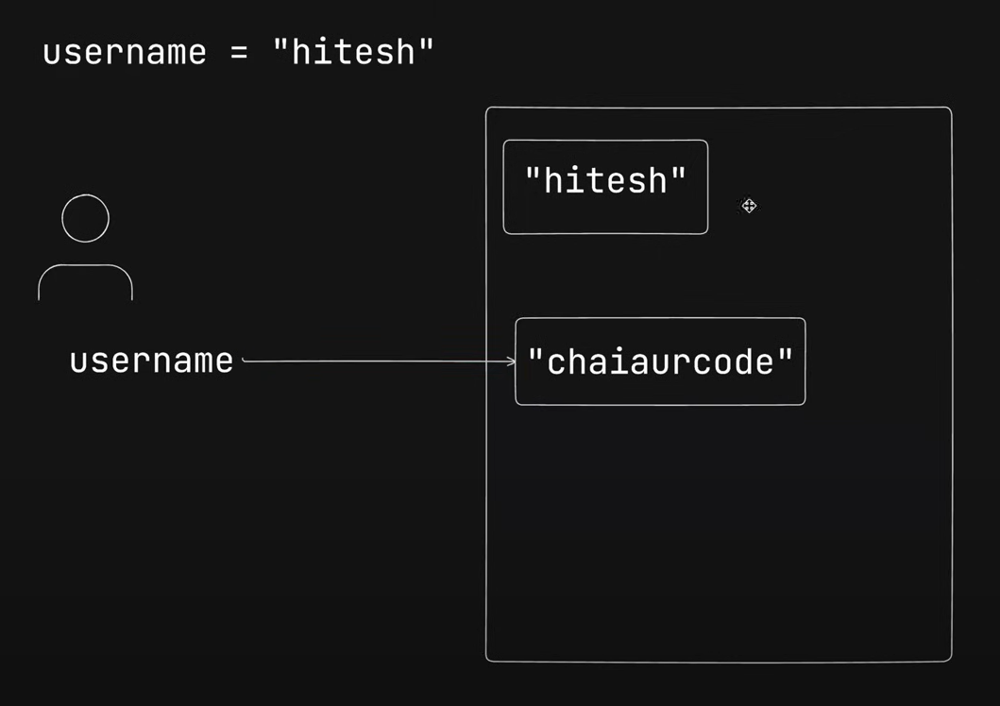
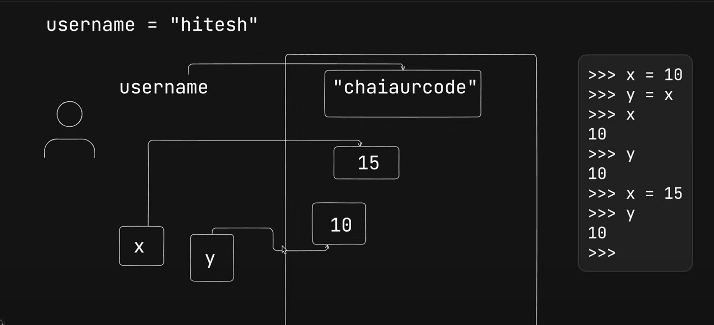

in python strings are not mutable ie immutable

object are called  as dictionary 

array are called  as list 

username = "prashant"
print(username)               prashant                
username = "suresh"
print(username)               suresh

Q. if strings are immutable how come username value is getting changed ? 
 ans = the variables are pointing to there memory location.

x = 10
y = x
print(x)           10
print(y)           10

x = 15
print(x)           15
print(y)           10

Number : 1234, 3.1415, 3+4j, 0b111, Decimal(), Fraction()

String : 'spam', "Bob's", b'a\x01c', u'sp\xc4m'

List : [1, [2, 'three'], 4.5], list(range(10))

Tuple : (1, 'spam', 4, 'U'), tuple('spam'), namedtuple

Dictionary : {'food': 'spam', 'taste': 'yum'}, dict(hours=10)

Set : set('abc'), {'a', 'b', 'c'}

File : open('eggs.txt'), open(r'C:\ham.bin', 'wb')

Boolean : True, False

None : None

Funtions, modules, classes

Advance: Decorators, Generators, Iterators, MetaProgramming